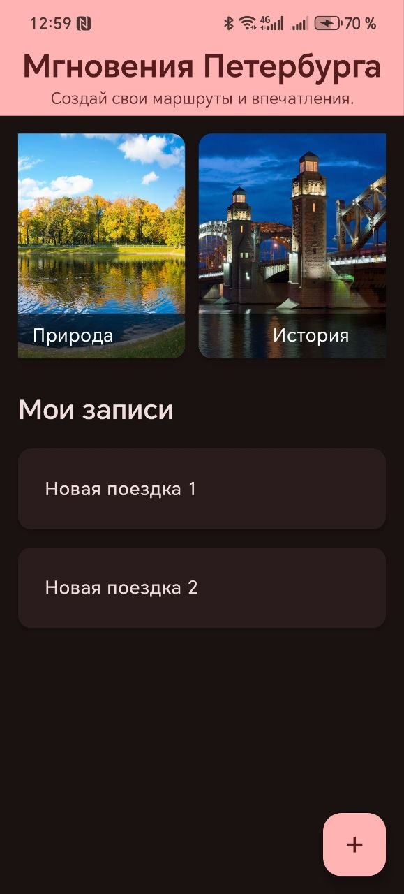
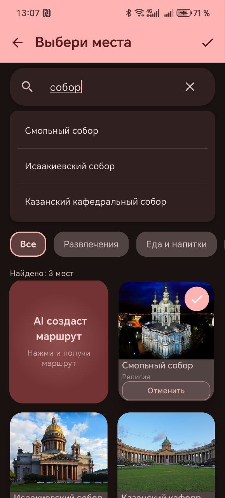
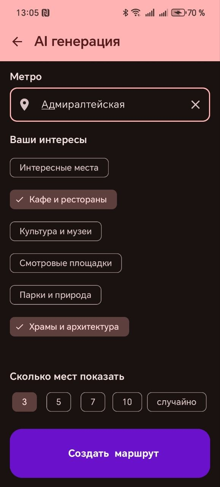

# Travel Planning

**Travel Planning** — Android-приложение для планирования путешествий и формирования пользовательских маршрутов по достопримечательностям Санкт-Петербурга

Приложение позволяет создавать поездки, добавлять интересующие локации, получать интеллектуальные рекомендации маршрутов, синхронизировать данные с сервером и работать без подключения к Интернету

  
  
  

---

# Возможности

* создание, редактирование и удаление поездок;
* добавление достопримечательностей в маршрут;
* просмотр подробной информации о каждой локации;
* поиск и фильтрация по категориям;
* интеллектуальные рекомендации маршрутов;
* синхронизация каталога локаций с сервером;
* локальная работа без подключения к Интернету;
* автоматическая загрузка изображений с кэшированием;
* экспорт маршрута через Android Share Intent (с автоматической генерацией ссылок на Яндекс Карты для каждой локации);
* динамическая тема Material You (Android 12+).

---

# Архитектура

Проект построен по архитектуре **MVVM (Model–View–ViewModel)**.

## Model

Слой данных включает:

* Room Database;
* DAO;
* Repository;
* локальное хранилище JSON;
* сетевой модуль Retrofit.

## ViewModel

Отвечает за:

* хранение состояния экранов;
* обработку пользовательских действий;
* взаимодействие с Repository;
* управление загрузкой данных;
* подготовку моделей для интерфейса.

Для передачи состояния используются **StateFlow** и **Kotlin Coroutines**.

## View

Интерфейс полностью реализован на **Jetpack Compose** с использованием Material Design 3.

---

# Работа с данными

Для локального хранения используется **Room Persistence Library**.

Связь между поездками и локациями реализована по схеме **Many-to-Many**.

Доступ к данным осуществляется через DAO и Repository.

Все операции выполняются асинхронно с использованием Kotlin Coroutines.

---

# Работа с сетью

Для взаимодействия с сервером используется **Retrofit** и **OkHttp**.

Поддерживаются следующие REST API:

* получение актуального JSON-каталога локаций;
* получение интеллектуальных рекомендаций;
* получение кластеров достопримечательностей;
* проверка доступности сервера (ping).

---

# Используемые технологии

* Kotlin
* Jetpack Compose
* MVVM
* Material Design 3
* Material You (Dynamic Color)
* Room
* SQLite
* Repository Pattern
* StateFlow
* Kotlin Coroutines
* Retrofit
* OkHttp
* Gson
* Coil
* Android Share Intent

---

# Особенности проекта

* полностью декларативный пользовательский интерфейс;
* реактивное обновление экранов через StateFlow;
* офлайн-режим работы;
* автоматическая синхронизация данных;
* экспорт маршрутов;
* поддержка современных компонентов Android Jetpack.

---

# Дальнейшее развитие

Разработка приложения продолжается. В будущих обновлениях планируется расширение функционала, улучшение пользовательского опыта и оптимизация работы приложения.
